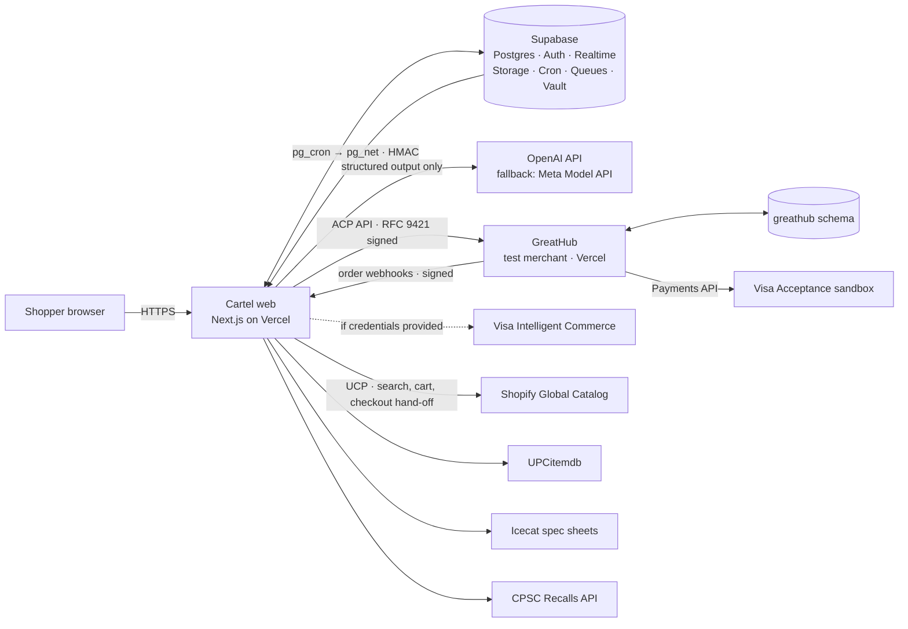

# Cartel

Cartel puts your exact requirements, inspectable evidence and a passkey-signed contract between an AI shopping agent and your card. You describe what you need; Cartel turns it into typed rules, picks a basket with a constraint solver, and proves every rule against sourced facts with a deterministic engine. You sign the contract's hash with a passkey. Before any payment, Cartel re-proves the live checkout against what you signed and pauses if something material changed: the same SKU with a weaker spec, a new seller, a final-sale flip. The payment runs on the Visa Acceptance sandbox, carries the contract hash, and leaves an Evidence Pack anyone can verify offline. The LLM is never on the path from facts to verdict to signature to payment.

GreatHub (`apps/greathub`) is our **test merchant**, with fictional brands and a Chaos Panel that changes listings in front of the judges. Payments are sandbox only.

- Design: [docs/SDD.md](docs/SDD.md) · task list: [docs/TASKS.md](docs/TASKS.md) · per-phase notes: `docs/PHASE*.md`
- Demo run sheet: [docs/DEMO.md](docs/DEMO.md) · Devpost draft: [docs/DEVPOST.md](docs/DEVPOST.md)

## Architecture



Each trust domain is its own package or app ([SDD §6.2](docs/SDD.md#62-trust-domains)):

| Domain | Where | Can't |
|---|---|---|
| Planner (AI) | `packages/ai` | Write verdicts, sign, or call checkout or payment. It has no tools with side effects. |
| Evidence | `packages/evidence`, `packages/catalog` | Decide pass or fail |
| Proof (pure) | `packages/proof-engine`, `packages/rule-packs`, `packages/solver` | Any I/O (enforced by Biome) |
| Consent | `packages/contracts`, `apps/web` signing routes, `contract_versions`, ledger | Execute payments |
| Execution | `internal.begin_execution` (SQL guard), `packages/payments`, `packages/acp`, `packages/tap` | Pay without a guard-issued, single-use execution token |
| Merchant | `apps/greathub` | Read Cartel data |

Also: `packages/evidence-pack` (the offline-verifiable zip and `verify.mjs`), `packages/platform` (env, health, logging, request IDs), `packages/bench` (ProofBench, Phase 16), `packages/db-tests` (database integration tests), `supabase/` (migrations, seed, pgTAP tests).

## Local setup

Use Node 24 (`.nvmrc`) and pnpm 10.34.5. If needed, run `nvm install`, `nvm use`, and `npm install -g pnpm@10.34.5`. Start Docker, then:

```sh
pnpm i                        # pnpm install --frozen-lockfile in CI
pnpm exec supabase start      # or: pnpm db:start
pnpm dev
```

- Cartel: http://localhost:3000 (the flagship demo plan is at `/plans/flagship`)
- GreatHub: http://localhost:3001 (Chaos Panel at `/chaos`, Agent Log at `/agents`)
- Supabase Studio: http://127.0.0.1:54323 · local email (Mailpit): http://127.0.0.1:54324

`supabase start` applies every migration and `supabase/seed.sql` (the GreatHub catalog). The apps run without credentials: pages with a table behind them fall back to demo data, and `/api/health` returns HTTP 503 until its dependencies are configured. Fonts are downloaded by `next/font` at build time.

If port 3000 is taken, run each app separately with `pnpm --filter @cartel/web exec next dev --port 3100` and `pnpm --filter @cartel/greathub exec next dev --port 3101`, and update the local base and JWKS URLs.

## Environment variables

Copy `apps/web/.env.example` to `apps/web/.env.local` and `apps/greathub/.env.example` to `apps/greathub/.env.local`. **Keep existing files.** Next.js reads each app's `.env.local`; a root `env.local` isn't loaded. The full, commented list is in the root [.env.example](.env.example) and [SDD §24](docs/SDD.md#environment-variables).

The minimum for a local run, with values from `pnpm exec supabase status`:

| Variable | Cartel | GreatHub |
|---|---|---|
| `NEXT_PUBLIC_SUPABASE_URL` | Local API URL | Same |
| `NEXT_PUBLIC_SUPABASE_PUBLISHABLE_KEY` | Local publishable key | Not needed |
| `SUPABASE_SECRET_KEY` | Local secret key | Local secret key |
| `CARTEL_JWKS_URL` | `http://localhost:3000/.well-known/jwks.json` | Same |
| `CARTEL_BASE_URL` | Not needed | `http://localhost:3000` |
| `AGENT_SIGNING_JWK`, `AGENT_KEY_ID` | An Ed25519 private JWK and its `kid` (below) | Not needed |
| `CHAOS_ADMIN_TOKEN` | Not needed | 16+ random characters |

Generate an Ed25519 private JWK (one line; keep it private):

```sh
node -e 'const {generateKeyPairSync}=require("node:crypto");const k=generateKeyPairSync("ed25519").privateKey.export({format:"jwk"});k.kid="ct-agent-2026-09";console.log(JSON.stringify(k))'
```

Restart the apps after changing env values. Only `NEXT_PUBLIC_` variables reach the browser; never give a secret that prefix.

External services:

| Service | Env keys | Notes |
|---|---|---|
| OpenAI (primary AI) | `OPENAI_API_KEY`, `OPENAI_MODEL_PRIMARY`, `OPENAI_MODEL_FAST` | `gpt-6-sol` + `gpt-6-luna` for demos; set both to `gpt-6-luna` while testing |
| Meta Model API (fallback AI) | `META_MODEL_API_KEY`, `META_BASE_URL`, `META_MODEL_*` | Muse Spark, OpenAI-compatible at `https://api.meta.ai/v1` |
| Visa Acceptance sandbox | `VISA_ACCEPTANCE_*` | Needed in both apps; GreatHub calls the Payments API |
| Authorize.net sandbox | `AUTHORIZE_NET_*` | Fallback rail |
| Icecat | `ICECAT_USERNAME`, `ICECAT_API_TOKEN` | Manufacturer specs; Open Icecat covers sponsor brands only |
| UPCitemdb | `UPCITEMDB_USER_KEY` (optional) | Replaces Best Buy (no access). Keyless trial: 100 requests/day per IP |

Budget and model choices are in [SDD §10.4](docs/SDD.md#104-providers-models-and-budget).

Anonymous sign-in and manual identity linking are enabled locally. An anonymous identity is created on the first client visit and stored in Supabase SSR cookies; `proxy.ts` verifies/refreshes identity on subsequent requests. Authorization belongs to each route and the database policies, not the proxy alone. Email auth is enabled by the CLI defaults; local messages land in Mailpit. Google OAuth remains disabled until real client credentials are available. Add them via `env(SUPABASE_AUTH_EXTERNAL_GOOGLE_CLIENT_ID)` and `env(SUPABASE_AUTH_EXTERNAL_GOOGLE_SECRET)` in the Google config block and enable it. Cloud Auth settings must be configured separately; local config does not automatically update a cloud project.

## Scripts

| Command | What it does |
|---|---|
| `pnpm dev` / `pnpm build` | Both apps, through Turborepo |
| `pnpm lint` / `pnpm format` | Biome check / fix |
| `pnpm typecheck` | Every package and app |
| `pnpm check` | lint + typecheck + test + build, as CI runs them |
| `pnpm db:start` / `db:stop` / `db:reset` | Local Supabase. `db:reset` wipes **local** data and re-seeds it. |
| `pnpm db:types` / `db:types:check` | Regenerate / check `packages/contracts/src/db.ts` |
| `pnpm ai:smoke` | One structured call per configured AI provider and model |
| `pnpm ai:warm` | Warms the provider's prompt cache for the A1 brief prompt |
| `pnpm ai:cost [--since 24h]` | AI spend from `ai_calls` |
| `pnpm demo:reset [--dry-run]` | Before a demo: GreatHub reset, clear the demo user's plans, warm caches ([DEMO.md](docs/DEMO.md)) |
| `pnpm demo:check [--visa]` | The automated part of the 30-minute pre-judging check |

## Tests and the bench

```sh
pnpm exec biome ci .          # lint, as CI runs it
pnpm test                     # unit + property tests (Vitest, fast-check)
pnpm db:lint                  # supabase db lint
pnpm db:test                  # pgTAP: RLS, guard, ledger, signing, mandates, GreatHub
pnpm db:test:integration      # DB integration tests against local Supabase
pnpm test:realtime            # private Realtime delivery and isolation (local only)
pnpm test:catalog             # builds and serves the web app; search over local sources
pnpm test:acp-contract        # ACP contract suite against a real GreatHub (simulated rail)
pnpm test:acp-contract --visa # the same on the Visa Acceptance sandbox
pnpm --filter @cartel/web test:a11y    # axe on the component gallery and pages
pnpm --filter @cartel/evidence-pack verify:bundle:check   # verify.mjs bundle is current
pnpm eval:ai                  # A1 eval set against the configured model
```

The Visa sandbox smoke tests are opt-in: `VISA_ACCEPTANCE_SMOKE=1` with the `VISA_ACCEPTANCE_*` variables set.

**ProofBench**: `/bench` runs live attacks (price swap, spec edit, seller swap, prompt text, a benign price drop) through the real consent diff on click, and shows the latest `bench_runs` row when one exists. The scenario suite and its CI job are Phase 16 in [TASKS.md](docs/TASKS.md).

Verify an Evidence Pack offline: download it from `/orders/<id>/evidence-pack`, then `node verify.mjs pack.zip`.

## Health and signing identity

Both `/api/health` routes check configuration, a real Postgres RPC, and reachable public signing keys. Responses contain only status labels and a request ID. HTTP 503 with an unconfigured signing identity is expected before key setup.

The web app publishes `/.well-known/jwks.json` from `AGENT_SIGNING_JWK` and `AGENT_KEY_ID`. Supply a valid Ed25519 private JWK and a matching key ID through private environment variables. The endpoint derives the public key and returns only `kty`, `crv`, `x`, `kid`, `use`, and `alg`. It never serializes the private input directly. GreatHub verifies Cartel's RFC 9421 agent requests against this JWKS. Contract signatures use passkeys instead (`/settings/signing`, [docs/PHASE12.md](docs/PHASE12.md)).

## Observability

Both apps initialize Sentry when their DSNs are configured. Configure `SENTRY_DSN` for server errors and `NEXT_PUBLIC_SENTRY_DSN` for browser errors. User information, cookies, bodies, query parameters, AI inputs/outputs, and database payload collection are disabled. Pino redacts credential, session, body, and payment fields. Request IDs propagate through proxies, health checks, outbound JWKS checks, and Sentry request-error tags.

In development, POST `/api/internal/diagnostics` with an `Origin` matching the local app to send a tagged test exception. It returns a Sentry event ID, request ID, and flush result. Check that event in Sentry to validate delivery. This endpoint is unavailable in production builds. Production source-map upload additionally needs `SENTRY_AUTH_TOKEN`, `SENTRY_ORG`, and `SENTRY_PROJECT` for each app.

## Deploy

Create Vercel projects rooted at `apps/web` and `apps/greathub`, using Next.js and Node 24. Keep workspace files outside the root directory available to the build. Install from the repository root with `pnpm install --frozen-lockfile`; build each app with its `pnpm build` script. Assign each project's environment variables separately. Both apps use the same Supabase project for each environment: dev for previews, prod for the stable demo.

The repository includes GitHub Actions jobs named `quality` and `database`. Set them as required PR checks in repository settings. Domains, HTTPS, cloud migrations, Google credentials and Sentry delivery are configured in each service's console, not in this repo. WebAuthn needs the stable production domain as `WEBAUTHN_RP_ID`; preview deployments can't sign.

There is one cloud project, `HackGt13`, and this checkout is already linked to it (`supabase/.temp/project-ref`). To relink, use `pnpm exec supabase login` and `pnpm exec supabase link --project-ref <ref>`. Review the target before applying any cloud migrations. Only `public` is exposed through the Data API; `internal` and `greathub` must stay unexposed. A Supabase secret key bypasses RLS project-wide, so separate secret keys alone don't isolate GreatHub's schema.
