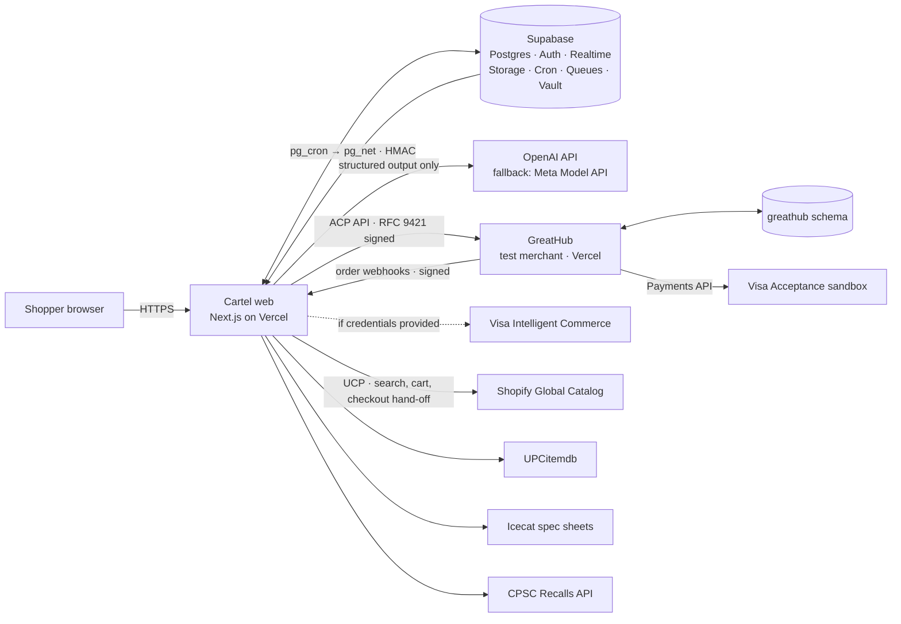

# Devpost submission (T18.5)

Paste each section into the matching Devpost field. Before submitting, fill the three links at the bottom and re-check the honesty notes against [DEMO.md §3](DEMO.md#3-what-the-current-build-shows-live). Claim only what the build does on submission day.

**Tagline (≤ 200 characters):** Cartel puts your exact requirements, the evidence, and a passkey-signed contract between an AI shopping agent and your card, and blocks any payment that no longer matches.

---

## Inspiration

AI agents can already find a product and press Buy, and the payment rails are getting ready for them: signed carts, agent tokens, checkout APIs. But a valid payment isn't the same as the right purchase. Between the moment you approve a cart and the moment it's charged, a merchant can quietly change what the SKU *is*: a monitor that charged your laptop at 90 W now does 15 W, a dress flips to final sale, a seller changes. Every signature still checks out. We wanted something that checks whether the purchase still *means* what you asked for.

## What it does

You describe what you need ("a home office under $1,000, the desk must fit a 48-inch alcove, a 27-inch 4K monitor that charges my MacBook over one USB-C cable, delivered by Monday"). Cartel turns that into:

1. **Typed requirements**, each tagged *You said*, *I assumed* or *Default*, so nothing the AI inferred becomes a hard rule without your confirmation.
2. **An evidence-backed basket** chosen by a constraint solver. Every spec says who states it (manufacturer, seller) and when, with the quote highlighted.
3. **A proof report** from a deterministic engine: pass, fail or *can't check* for every rule. `unknown` never passes.
4. **A purchase contract**: canonical JSON (RFC 8785), hashed, and signed with your passkey over that exact hash.
5. **A consent diff before every payment.** Cartel re-reads the live checkout and re-proves it against the signed contract. Harmless changes (the webcam got $4 cheaper) are accepted under your autonomy setting. Material ones pause the purchase before any money moves.
6. **A guarded payment** on the Visa Acceptance sandbox. A database guard issues a single-use execution token only for a signed, unexpired, unchanged contract, and the payment carries the contract hash.
7. **An Evidence Pack** anyone can verify offline with `node verify.mjs`: the contract hash, the passkey signature and the hash-chained ledger.

The demo's key moment is the **deal trap**. The same SKU drops from $329 to $319, which fires your "buy when ≤ $320" mandate, but the listing now says 15 W USB-C power. The cart hash, merchant and amount all check out; Cartel's re-proof fails 15 W < 65 W, and the purchase is paused. *The payment was valid. The purchase wasn't.*

Cartel is also a browsable catalog across real sources, where any search filter becomes a purchase rule in one click. It is honest about where it can pay: full guarded checkout, hand-off to the store, or proof only.

## How we built it

- **Monorepo** (pnpm + Turborepo, strict TypeScript): two Next.js 16 apps and fourteen packages, each a trust domain.
- **Proof engine, rule packs, solver**: pure TypeScript with no I/O (enforced by lint). Units and money are exact; rule packs for home office, apparel and travel; baskets are solved with HiGHS (WASM MILP), with an exhaustive engine for small problems.
- **AI layer** (Vercel AI SDK, OpenAI with a Meta Model API fallback): structured output only, and **no tools with side effects**. It proposes drafts and quotes; code checks that every quote exists in the stored source and parses the numbers itself.
- **Consent**: SimpleWebAuthn with a custom challenge `ct1:{contract hash}:{nonce}`; Supabase Postgres enforces the contract state machine, the append-only hash-chained ledger and the payment guard in SQL, behind row-level security.
- **Checkout**: ACP to our test merchant, with every agent request signed per RFC 9421 (Visa TAP-style) and verified against Cartel's JWKS; scoped Ed25519 payment grants; Visa Acceptance (Microform + TMS + Payments API).
- **Catalog**: Shopify Global Catalog via UCP, UPCitemdb, Icecat spec sheets and GreatHub, snapshotted with provenance; Postgres full-text + trigram search.
- **Design**: a paper-and-doodle system where each stick figure is one trust domain: the Scout (AI) finds, the Inspector proves, the Notary stamps, the Guard blocks. Pencil means tentative, ink means a source states it, a stamp means committed.

Architecture (render this Mermaid at mermaid.live and upload the PNG as the first gallery image):

## Challenges we ran into

- **Hashing the same thing everywhere.** The contract hash has to match across the browser, Node, Postgres and an offline verifier. That meant RFC 8785 canonical JSON, and a ledger hash defined byte-for-byte over Postgres's `jsonb` text form.
- **Passkeys can't sign arbitrary data.** Supabase passkeys handle sign-in with a server-generated challenge, so we built a separate WebAuthn ceremony whose challenge *contains* the contract hash, and verify it twice (online and offline).
- **Idempotency under retries.** A guard token that is consumed in the database, plus idempotency keys at the merchant, so a retried or replayed payment never charges twice.
- **Honest evidence.** Deciding what *can't* be checked (comfort, looks) and saying so, instead of letting a model guess.

## Accomplishments that we're proud of

- The LLM is never on the path from facts to verdict to signature to payment. Remove it, and proof, signing, the guard and payment still work.
- The deal trap: a mutation that passes every existing payment-layer check and is still caught.
- A self-verifying Evidence Pack: one zip, one `node verify.mjs`, no network.

## What we learned

- Agent-payment standards (AP2, ACP, UCP, TAP) solve *who* is paying and *what cart* was sent. They don't decide whether the cart still means what the user asked for. That gap is the product.
- Deterministic code plus quote-grounded AI is far easier to trust, test and demo than a model that decides.

## What's next

- Wire the AI brief interpretation and the AI-off toggle into the web app end to end.
- The full ProofBench suite (62 scenarios across identity, economics, terms, delivery, evidence and security) running in CI and published on `/bench`.
- Visa Intelligent Commerce agent tokens and Payment Instructions, once we have credentials.
- More merchants on guarded checkout, and a merchant-side verifier for signed contracts as dispute evidence.

## Honesty notes

- **GreatHub is our test merchant.** Its brands (Birchline, Kestrel, Vireo, Halden, …) are fictional so that Chaos Panel edits never misrepresent real products. It's labeled as a test merchant everywhere.
- **Payments run on the Visa Acceptance sandbox.** Authorizations are real sandbox authorizations; no real money moves.
- **The scoped payment grant emulates agent-token controls** (merchant, amount and expiry bound to the signed contract). It is not a Visa-issued agent token.
- **VIC status:** not integrated. Visa Intelligent Commerce sits behind the same `PaymentRail` interface as an explicit stub that never falls back silently. We'll switch it on if credentials are provided.
- **The flagship demo plan is served from fixtures run through the real engine.** Signing, the guard and payment are exercised live on stored plans and in the contract suite. Live Shopify results depend on the source being reachable; Explore falls back to a warm cache.
- *(Edit before submitting.)* If the Phase 16 suite hasn't landed, say "five live attacks" for `/bench`, not "62/62".

## Screenshots (gallery order)

Capture at 1440 px wide in the light theme after `pnpm demo:reset`; add a caption to each.

1. Architecture diagram (from the Mermaid above).
2. Landing page with the cast: `/`
3. Explore search: `/search?q=navy linen shirt`
4. Product page with specs and receipts: open a result from 3.
5. Workspace: `/plans/flagship`
6. Paused screen with the Guard and the layers table: `/plans/flagship/diff/deal-trap`
7. Contract with its stamp and hash: `/plans/flagship/contract`
8. ProofBench: `/bench`
9. GreatHub Agent Log: `greathub.<domain>/agents`

## Links

- Live app: `https://cartel.<domain>`
- Repository: `https://github.com/ItsHariii/HackGt13`
- Video (unlisted): `https://youtu.be/<id>`

## Built with

typescript · next.js · react · tailwind-css · supabase · postgresql · webauthn · passkeys · visa-acceptance · cybersource · openai · vercel-ai-sdk · highs · vitest · playwright · vercel · shopify-ucp · rfc-9421
